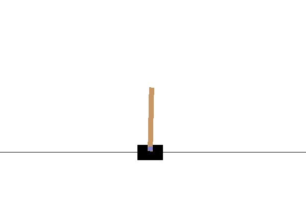
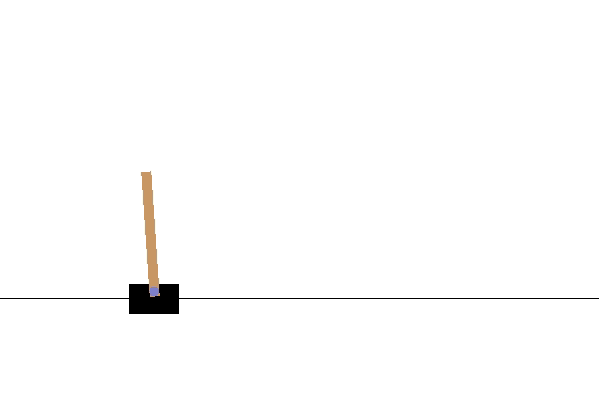

# CartPole-v1 Actor Critic
CartPole-v1 is an environment presented by OpenAI Gym. In this repository we have used Actor Critic algorithm [1] for building an agent to solve this environment.

### Commands to run
#### To train the model
python train_model.py

#### To test the model
python test_model.py 'path_of_saved_model_weights' (without quotes)

To test agent with our trained weights: python test_model.py saved_model/475.0.h5

### Results

#### Output of agent taking random actions

#### Output of our agent at Episode: 100 with score 475.0

### References
[1] Actor-Critic Algorithms 
    Authors: Vijay R. Konda John N. Tsitsiklis
    Link: https://papers.nips.cc/paper/1786-actor-critic-algorithms.pdf

